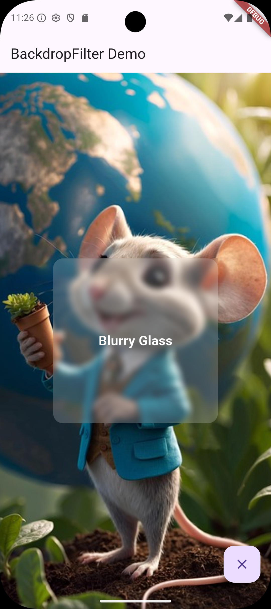

# BackdropFilter Widget Demo

**BackdropFilter** creates a frosted glass effect by applying a blur filter to content behind a widget, commonly used for modern overlay panels and modals.

## Demo Screenshot



*The demo shows a frosted glass panel overlay. Click the floating action button (bottom-right) to toggle the panel and see the BackdropFilter effect in action.*

## Run Instructions

1. Clone this repository:
   ```bash
   git clone https://github.com/bienvenudev/widget_presentation.git
   cd widget_presentation
   ```

2. Install dependencies:
   ```bash
   flutter pub get
   ```

3. Run the app:
   ```bash
   flutter run
   ```
   Or for web:
   ```bash
   flutter run -d chrome
   ```

4. Click the floating button (bottom-right corner) to show/hide the frosted glass panel.

## Three Key Properties

### 1. **filter** (Required)
Defines the visual effect applied to background content. Uses `ImageFilter.blur()` with `sigmaX` and `sigmaY` parameters to control blur intensity. Higher values (e.g., 15.0) create stronger blur; lower values (e.g., 2.0) create subtle effects. Essential for creating the frosted glass appearance.

### 2. **blendMode** (Optional, defaults to srcOver)
Controls how the filtered content blends with the background. `BlendMode.srcOver` provides normal overlay (standard frosted glass). Other options like `multiply`, `screen`, or `overlay` create different visual effects. Developers adjust this to match design requirements.

### 3. **child** (Required)
The widget displayed on top of the blurred background. This contains your UI content (text, buttons, etc.). Without a child, only the blur effect is visible. The semi-transparent Container enhances the frosted glass effect.

## Real-World Use Case

This demo simulates a modern photo viewer app with a settings overlay. When users tap the floating button, a frosted glass panel appears, keeping the background visible while focusing attention on the foreground content. This pattern is common in iOS and modern mobile/web applications for modals, settings panels, and overlay menus.

## Code Attribution

Base structure inspired by Flutter documentation examples.
